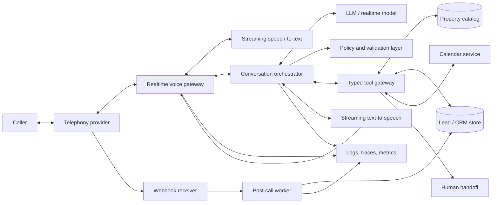

# Real Estate Voice Agent — Implementation Plan

## 1. Product vision

Build an AI voice assistant for a real-estate agency that can answer inbound calls, qualify buyers and renters, search a property catalog, answer listing questions, propose viewing times, and hand high-value or sensitive calls to a human agent. After each call, it produces a transcript, structured lead record, concise summary, and follow-up tasks.

The portfolio version should demonstrate a reliable business workflow rather than a generic voice chatbot. Its central story is:

> A prospective client calls, has a natural conversation, receives grounded property recommendations, books a viewing, and leaves the human agent with a complete and actionable CRM record.

### Success criteria

- The assistant responds naturally with low perceived latency.
- Every property claim is grounded in the property database.
- The caller can interrupt the assistant while it is speaking.
- The assistant captures required lead criteria without sounding like a form.
- A qualified caller can book a viewing or reach a human.
- Each completed call creates an accurate summary and structured lead record.
- Consent, retention, deletion, and escalation behavior are demonstrable.

### MVP scope

The first usable version will support one agency, one language (English), inbound buyer/renter calls, a seeded property catalog, viewing requests, and simulated human handoff. French can be added after the core flow is reliable.

### Explicit non-goals for the MVP

- Giving legal, tax, mortgage, or investment advice
- Negotiating or accepting offers
- Collecting payment-card, banking, government-ID, or authentication data
- Making autonomous outbound marketing calls
- Replacing the agency's system of record
- Inferring protected or sensitive characteristics about callers or neighborhoods

## 2. Users and primary use cases

### Prospective buyer or renter

- Ask whether a specific property is available.
- Search by budget, location, property type, bedrooms, amenities, and commute needs.
- Clarify listing details such as size, floor, fees, parking, or accessibility.
- Request or book a viewing.
- Ask for a human agent.

### Real-estate agent

- Receive qualified leads instead of incomplete voicemail.
- See a call summary, transcript, preferences, recommended listings, and next action.
- Take over a live call when escalation is required.
- Correct extracted information and audit what the assistant said.

### Agency manager

- Configure business hours, escalation rules, disclosures, and knowledge content.
- Review operational metrics without exposing unnecessary personal data.
- Inspect failures, booking conversion, and handoff quality.

## 3. Functional requirements

### During a call

1. Answer and identify the agency and the automated nature of the assistant.
2. Provide a recording/transcription disclosure and obtain consent where required.
3. Detect intent: property inquiry, new search, viewing, status question, human request, or unsupported request.
4. Gather only missing qualification fields conversationally.
5. Search listings using structured filters.
6. Describe a small number of relevant results using verified fields only.
7. Answer follow-up questions using listing data and approved agency content.
8. Check viewing availability and create a tentative or confirmed booking.
9. Escalate on request, uncertainty, distress, complaints, discrimination-related requests, or high-value opportunities.
10. Confirm names, email addresses, phone numbers, dates, and addresses before saving or acting.

### After a call

1. Finalize transcript and call metadata.
2. Extract structured preferences with per-field confidence.
3. Generate a factual summary with citations to transcript timestamps internally.
4. Upsert the lead and log consent.
5. Save discussed properties and tool outcomes.
6. Create follow-up tasks and notify the assigned agent.
7. Apply retention and redaction policies.

## 4. Reference architecture



### Component responsibilities

| Component | Responsibility |
|---|---|
| Telephony provider | Phone number, inbound call control, audio streaming, transfer, call status webhooks |
| Realtime voice gateway | WebSocket/media-session lifecycle, audio buffering, interruption handling, codec conversion, timeouts |
| Conversation orchestrator | State machine, prompt/session context, turn policy, tool execution, recovery, escalation |
| STT/TTS or speech-to-speech model | Transcription and natural voice output; stream partial results to minimize latency |
| Policy and validation layer | Consent gate, tool authorization, argument validation, response grounding, PII redaction |
| Typed tool gateway | Stable business APIs exposed to the model; idempotency, authentication, audit logs |
| Application database | Listings, leads, calls, consents, bookings, tool events, summaries |
| Post-call worker | Extraction, summarization, notifications, evaluation, retention jobs |
| Agent console | Live-call status, handoff context, lead review, transcript and outcome inspection |
| Observability stack | Structured events, distributed traces, metrics, redacted error reporting, alerts |

### Runtime design principles

- Keep deterministic workflow state outside the model.
- Treat model output as untrusted input until schema validation succeeds.
- Give the model narrowly scoped tools instead of database access.
- Separate conversational acknowledgements from committed business actions.
- Require a confirmation step before booking, updating contact data, or initiating transfer.
- Store the exact property IDs and fields used to formulate recommendations.
- Degrade gracefully: retry once, then offer SMS/email follow-up, voicemail, or human transfer.

## 5. Suggested technology stack

Choose one provider in each replaceable category; keep provider-specific code behind adapters.

| Layer | Recommended MVP choice | Alternatives / notes |
|---|---|---|
| Backend | Python 3.12, FastAPI, Pydantic | TypeScript with Fastify or NestJS is equally suitable |
| Conversation control | Explicit state machine plus model tool calling | Avoid embedding business rules only in prompts |
| Voice/LLM | A realtime speech model, or streaming STT + LLM + TTS | Compare quality, latency, language support, data terms, and regional availability before selection |
| Telephony | Twilio Voice Media Streams | Telnyx or Vonage through a provider adapter |
| Database | PostgreSQL | Add PostGIS if map/radius search becomes important |
| Search | PostgreSQL full-text and structured filters | Add a vector index only for unstructured agency documents, not basic listing filters |
| Cache/session | Redis | In-memory sessions are acceptable only for a local demo |
| Jobs | Dramatiq or Celery with Redis | A managed queue is preferable in production |
| Admin/demo UI | Next.js with TypeScript | Include browser-call mode to make the portfolio demo easy to run |
| ORM/migrations | SQLAlchemy 2 + Alembic | Keep migrations in source control |
| Testing | Pytest, Hypothesis, Playwright, k6 | Add prerecorded audio fixtures and conversation simulations |
| Packaging | Docker and Docker Compose | Separate API, worker, UI, PostgreSQL, and Redis services |
| CI/CD | GitHub Actions | Lint, type-check, test, scan, migrate in staging, deploy |
| Observability | OpenTelemetry, Prometheus/Grafana, Sentry-compatible error tracking | Never send raw sensitive fields by default |

### Repository shape

```text
apps/
  api/                 # HTTP/webhook endpoints and business services
  voice_gateway/       # realtime audio and call session handling
  worker/              # post-call extraction and notifications
  web/                 # demo and agent console
packages/
  domain/              # entities, policies, state machine, interfaces
  tools/               # model-facing typed tools
  providers/           # telephony, model, calendar, CRM adapters
  prompts/             # versioned prompts and examples
  evals/               # scenarios, rubrics, datasets, reports
infra/
  docker/              # local environment
  deploy/              # deployment configuration
docs/
  architecture/        # diagrams, decisions, runbooks, threat model
```

## 6. Data model

Use UUIDs, UTC timestamps, immutable event records where practical, and tenant/agency IDs on business records even if the demo has only one agency.

### Core entities

#### `agencies`

- `id`, `name`, `timezone`, `default_language`
- `business_hours`, `handoff_number`
- `disclosure_text`, `retention_policy_days`

#### `properties`

- `id`, `agency_id`, `external_ref`, `status`
- `transaction_type` (`sale` or `rent`), `property_type`
- `title`, `description`, `address_display`, `city`, `postal_code`
- `latitude`, `longitude`
- `price`, `currency`, `fees`, `deposit`
- `bedrooms`, `bathrooms`, `area_m2`, `floor`, `total_floors`
- `amenities` (normalized tags or JSON), `available_from`
- `agent_id`, `source_updated_at`, `created_at`, `updated_at`

Store sensitive access instructions separately from caller-visible listing data. Every field should have an explicit visibility classification.

#### `leads`

- `id`, `agency_id`, `status`, `source`
- `name`, `phone_e164`, `email`
- `preferred_language`, `assigned_agent_id`
- `contact_consent_status`, `contact_consent_at`
- `created_at`, `updated_at`, `deleted_at`

#### `lead_preferences`

- `lead_id`, `intent`, `transaction_type`
- `budget_min`, `budget_max`, `currency`
- `locations`, `property_types`, `bedrooms_min`, `area_min_m2`
- `must_have_amenities`, `nice_to_have_amenities`
- `move_timeline`, `financing_status`, `commute_destination`, `commute_limit_minutes`
- `free_text_notes`
- `field_confidences` and `source_call_id`

#### `calls`

- `id`, `provider_call_id`, `agency_id`, `lead_id`
- `direction`, `status`, `started_at`, `answered_at`, `ended_at`
- `language`, `disposition`, `handoff_reason`
- `recording_uri_encrypted`, `transcript_status`, `prompt_version`
- `model_id`, `consent_id`, `error_code`

#### `call_turns`

- `id`, `call_id`, `sequence`, `speaker`
- `text_redacted`, `started_offset_ms`, `ended_offset_ms`
- `confidence`, `interrupted`, `created_at`

Raw transcript access should be more restricted than redacted transcript access.

#### `tool_executions`

- `id`, `call_id`, `turn_id`, `tool_name`, `request_id`
- `arguments_redacted`, `result_redacted`, `status`, `latency_ms`
- `idempotency_key`, `created_at`

#### `property_matches`

- `call_id`, `lead_id`, `property_id`, `rank`
- `match_reasons`, `constraints_satisfied`, `presented_to_caller`

#### `viewing_slots` and `viewings`

- Slot: `id`, `property_id`, `agent_id`, `starts_at`, `ends_at`, `status`
- Viewing: `id`, `slot_id`, `lead_id`, `call_id`, `status`, `confirmation_channel`, `idempotency_key`

#### `consents`

- `id`, `lead_id` (nullable until identified), `call_id`
- `type`, `status`, `policy_version`, `captured_at`, `evidence_turn_id`

#### `call_summaries` and `follow_up_tasks`

- Summary: intent, outcome, factual summary, objections, next step, extraction confidences
- Task: owner, type, due date, priority, status, related lead/property/call

### Important constraints

- Unique `provider_call_id` per call and `idempotency_key` per external mutation.
- Price and money values use fixed-precision decimals, never floating point.
- Booking transactions must lock or re-check slot availability before commit.
- Contact fields are encrypted at rest or protected through field-level access controls.
- Deletion workflows cover derived records, recordings, transcripts, logs, and provider copies.

## 7. Conversation state machine and core call flows

### High-level states

```text
GREETING -> DISCLOSURE -> INTENT -> QUALIFICATION -> SEARCH -> DISCUSSION
                                            |          |          |
                                            +----------+----------+-> VIEWING
                                                                  -> HANDOFF
                                                                  -> WRAP_UP
Any state -> SAFETY_STOP / RECOVERY / HANDOFF
```

The orchestrator owns state transitions. The model proposes the next response or tool request but cannot bypass required gates.

### Flow A: New buyer or renter search

1. Greet, disclose automation, and handle recording/transcription consent.
2. Determine sale versus rent and the caller's broad objective.
3. Collect budget, target area, property type, bedrooms, timeline, and one or two priority features.
4. Restate the hard constraints and ask for correction.
5. Call `search_properties` with normalized filters.
6. Present at most three matches and explain each using returned data.
7. Refine based on feedback; do not repeatedly ask for already known information.
8. Offer a viewing, a link/list by approved channel, or human follow-up.
9. Confirm contact details and contact consent before follow-up.
10. Summarize the agreed next step and close.

### Flow B: Specific listing inquiry

1. Identify the listing by reference, address fragment, or phone-routing metadata.
2. Call `get_property_details` and check availability/freshness.
3. Answer only fields returned as caller-visible.
4. If the answer is missing or stale, state that plainly and create an agent follow-up.
5. Offer related listings or a viewing.

### Flow C: Book a viewing

1. Confirm the property and the caller's preferred date range/timezone.
2. Call `get_viewing_slots`.
3. Offer two or three options.
4. Collect and read back caller name and contact details.
5. Read back property, date, time, timezone, and contact method.
6. On explicit confirmation, call `book_viewing` once with an idempotency key.
7. Communicate success only after the tool confirms it.
8. If the slot is lost, apologize, refresh availability, and offer alternatives.

### Flow D: Human handoff

Trigger immediately when the caller asks for a person, consent is declined and a person can handle the request, the caller is distressed, a complaint or legal issue arises, the tool layer repeatedly fails, or the assistant is materially uncertain.

1. Tell the caller why transfer is being offered without exposing internal scores.
2. Call `check_agent_availability`.
3. Generate a short whisper summary for the agent.
4. Call `transfer_call` and remain silent once the transfer begins.
5. If unavailable, offer callback scheduling or voicemail.

### Flow E: Unsupported or risky request

- Do not advise on legal rights, taxes, lending eligibility, or investment returns.
- Provide an approved neutral disclaimer and offer a qualified human.
- Reject discriminatory search criteria or steering. Offer objective property features and caller-specified geographic areas instead.
- Never reveal access codes, seller circumstances, private notes, or other callers' information.

### Recovery rules

- After low-confidence transcription, ask a focused clarification rather than guessing.
- Confirm critical entities phonetically or digit-by-digit where appropriate.
- After one transient tool failure, retry safely with the same idempotency key.
- After repeated failure, stop tool attempts and offer a human/callback.
- If silence persists, prompt twice, then close politely.
- If the caller interrupts, stop audio output quickly and process the new utterance.

## 8. APIs and model tool-calling

### External HTTP/webhook endpoints

| Method and path | Purpose |
|---|---|
| `POST /webhooks/telephony/inbound` | Accept an inbound call and return call-control instructions |
| `WS /voice/stream/{call_id}` | Bidirectional audio/event stream |
| `POST /webhooks/telephony/status` | Receive ringing, answered, completed, transfer, and recording events |
| `POST /webhooks/calendar` | Receive slot and booking changes |
| `GET /api/properties` | Agent-console listing search |
| `GET /api/calls/{id}` | Authorized call detail with redacted transcript and audit trail |
| `GET /api/leads/{id}` | Lead profile and interaction history |
| `PATCH /api/leads/{id}` | Human correction of extracted fields |
| `POST /api/calls/{id}/handoff` | Manual transfer/takeover command |
| `POST /api/privacy/export` | Data-subject access/export workflow |
| `POST /api/privacy/delete` | Verified deletion workflow |

Verify webhook signatures, reject replayed events, enforce rate limits, and keep API and provider credentials in a secrets manager.

### Model-facing tools

Each tool uses strict JSON Schema, server-side validation, least-privilege authorization, a short timeout, and a small result payload.

#### `search_properties`

Inputs: transaction type, normalized locations, price range, bedrooms, area, property type, amenities, availability, result limit.  
Returns: property IDs, caller-visible fields, constraint matches, freshness timestamp, and a deterministic sort score.

#### `get_property_details`

Inputs: property ID and requested field names.  
Returns: only caller-visible fields, source timestamp, and missing/stale indicators.

#### `get_viewing_slots`

Inputs: property ID, date range, timezone, and optional preferences.  
Returns: available slot IDs with localized display values and expiry.

#### `book_viewing`

Inputs: slot ID, lead ID, confirmed contact method, explicit-confirmation flag, idempotency key.  
Returns: confirmed booking ID and details, or a typed conflict/error.

#### `upsert_lead`

Inputs: confirmed identity/contact fields, preferences, field provenance, consent state.  
Returns: lead ID and updated field list. It must not overwrite higher-confidence human-entered values without a review rule.

#### `create_follow_up_task`

Inputs: lead ID, reason, priority, due window, related property IDs, owner-routing hint.  
Returns: task ID and assigned agent/team.

#### `check_agent_availability` and `transfer_call`

Transfer requires a valid live call, an allowed destination returned by the server, and a caller-facing acknowledgement. The model never supplies arbitrary phone numbers.

#### `send_property_summary`

Inputs: lead ID, approved channel, property IDs, template ID, consent evidence.  
Returns: delivery status. Use fixed templates and links; do not let the model invent attachment URLs.

### Example validated tool call

```json
{
  "tool": "search_properties",
  "arguments": {
    "transaction_type": "sale",
    "locations": ["Courbevoie", "Puteaux"],
    "price": {"max": 350000, "currency": "EUR"},
    "bedrooms_min": 2,
    "must_have_amenities": ["balcony"],
    "limit": 3
  }
}
```

### Prompt and context strategy

- A short system policy defines identity, boundaries, disclosure, tone, and escalation.
- The orchestrator injects current state, confirmed facts, unresolved fields, and allowed next tools.
- Tool descriptions define when a call is allowed and what confirmation is required.
- Listing facts arrive only through tools, not a large prompt dump.
- Prompts are versioned and linked to every call for reproducibility.
- Conversation memory is call-scoped; long-term CRM memory is retrieved explicitly and permission-checked.

## 9. Safety, privacy, and compliance

This section is product-engineering guidance, not legal advice. Before a real launch, obtain jurisdiction-specific review, especially for recording consent, telemarketing, automated decision-making, fair-housing/anti-discrimination duties, and data transfers.

### Privacy by design

- Announce that the caller is interacting with an AI; never impersonate a human.
- State whether audio is recorded or transcribed and honor the configured consent flow.
- If consent is declined, disable recording/transcription where technically possible and offer a compatible human channel.
- Collect only information needed for the stated purpose.
- Separate operational consent from optional marketing consent.
- Record consent purpose, policy version, timestamp, and evidence.
- Provide access, correction, export, and deletion workflows.
- Define retention periods by data class; automatically purge expired audio, raw transcripts, and logs.
- Encrypt in transit and at rest; rotate secrets; restrict transcript and recording access by role.
- Redact phone, email, financial details, access codes, and free-text PII before analytics/error export.
- Document subprocessors, data regions, transfer mechanisms, and deletion behavior.

### Real-estate fairness safeguards

- Do not rank, exclude, recommend, or characterize areas using protected characteristics or proxies.
- Do not answer requests such as finding a neighborhood with a particular racial, religious, familial, disability, or other protected composition.
- Avoid subjective neighborhood labels such as “safe,” “good for families,” or “up-and-coming.”
- Provide objective listing attributes and direct callers to authoritative public sources for their own evaluation.
- Test equivalent caller scenarios across names, accents, languages, budgets, family descriptions, and disability-related requests.
- Log policy-trigger categories without retaining unnecessary sensitive utterances.

### Model and tool safety

- Allowlist tools per state and validate all arguments server-side.
- Require explicit confirmation for external side effects.
- Use idempotency keys for every mutation.
- Prevent prompt injection from listing descriptions and retrieved documents by treating them as data.
- Never expose internal prompts, credentials, private remarks, or unrestricted database fields.
- Ground listing answers and block unsupported numeric claims.
- Apply maximum call duration, turn count, tool-call count, and spending limits.
- Provide a visible kill switch and human override.

### Security baseline

- Threat-model spoofed webhooks, websocket hijacking, replay, enumeration, prompt injection, excessive tool calls, tenant crossover, and transcript leakage.
- Verify provider signatures and short-lived stream tokens.
- Use scoped service identities and tenant-aware queries.
- Maintain immutable audit events for consent, data access, booking, transfer, correction, and deletion.
- Run dependency, secret, container, and infrastructure scans in CI.
- Back up transactional data and regularly test restoration.
- Create incident response and provider-outage runbooks.

## 10. Phased milestones

Assumption: one developer working part-time. Timings are indicative and should be adjusted after a one-day provider spike.

### Phase 0 — Discovery and design (2–3 days)

Deliverables:

- Define agency persona, target callers, supported intents, and escalation policy.
- Write 20 representative call scripts including failure and safety cases.
- Finalize consent text and retention assumptions for the demo.
- Create architecture decision records for voice approach, telephony, database, and deployment.
- Define evaluation rubric and baseline targets before implementation.

Exit criteria: approved scope, documented non-goals, schemas, call-state diagram, and test scenarios.

### Phase 1 — Text-based vertical slice (week 1)

Deliverables:

- Seed 30–50 realistic synthetic properties.
- Implement database migrations and property/lead repositories.
- Build the state machine and typed property-search/detail tools.
- Add a browser text simulator showing state, tool calls, and citations.
- Implement post-conversation structured extraction and summary.

Exit criteria: scripted conversations find valid properties without hallucinated fields; summaries pass manual review.

### Phase 2 — Browser voice MVP (week 2)

Deliverables:

- Add microphone/audio streaming, STT/TTS or realtime speech sessions.
- Implement barge-in, silence handling, partial transcripts, and latency instrumentation.
- Add viewing slot lookup and idempotent booking in a mock calendar.
- Build a small call review screen with transcript, lead fields, matches, and booking.

Exit criteria: a user can complete the primary search-to-booking flow in a browser, including interruption and correction.

### Phase 3 — Real phone integration (week 3)

Deliverables:

- Provision a test number and telephony webhooks/media stream.
- Verify webhook signatures and add call lifecycle recovery.
- Implement human-transfer simulation or a verified test destination.
- Add phone-number normalization, keypad fallback, and connection-loss behavior.
- Add post-call jobs and agent notification.

Exit criteria: ten end-to-end test calls complete with correct records and no duplicate bookings.

### Phase 4 — Reliability, safety, and evaluation (week 4)

Deliverables:

- Build automated conversation simulations and audio regression fixtures.
- Add policy tests, adversarial prompts, consent tests, and fairness scenario pairs.
- Implement redaction, retention job, data export/deletion, access roles, and audit events.
- Add dashboards, alerts, prompt/model versioning, and fallback behavior.
- Run load and fault-injection tests.

Exit criteria: critical scenarios meet targets; no unresolved high-severity security/privacy findings; outage paths are usable.

### Phase 5 — Portfolio polish and deployment (week 5)

Deliverables:

- Deploy a stable demo environment with synthetic data.
- Add guided browser demo and optional test-number access controls.
- Record a concise demo video and publish architecture/evaluation documentation.
- Create screenshots, a case-study README, setup instructions, and known limitations.
- Add a one-command local development setup with sample environment variables.

Exit criteria: a reviewer can understand, run, and evaluate the project without private credentials.

### Post-MVP extensions

- French language and mid-call language switching
- Calendar and CRM provider adapters
- Secure SMS/email listing follow-up
- Seller/landlord inquiry flow
- Outbound callbacks only with explicit consent and applicable compliance controls
- Geospatial and transit-time search using authoritative APIs
- Supervisor analytics and human quality-review queues

## 11. Testing and evaluation strategy

### Unit tests

- Money, timezone, phone, address, and date normalization
- Search filter construction and deterministic ranking
- State transitions and tool allowlists
- Confirmation, consent, escalation, and retry policies
- Schema rejection for missing, malformed, or excessive tool arguments
- Idempotent booking and webhook replay protection
- Redaction and retention classification

### Integration tests

- Telephony webhook signature and lifecycle fixtures
- Realtime session connect/disconnect/reconnect
- Database transactions and concurrent slot booking
- Calendar/CRM/provider timeouts and typed error mapping
- Worker retries without duplicate side effects
- Tenant isolation and role-based access

### Conversation and model evaluations

Create versioned scenario files with caller persona, goal, property truth set, expected captured fields, allowed tools, forbidden behavior, and a scoring rubric.

Required scenario groups:

- Straightforward buyer and renter searches
- Ambiguous budgets, dates, locations, and property references
- Corrections and contradictions
- Strong accents, noise, numbers, spelling, and interruptions
- No-result searches and stale listing data
- Slot conflicts and provider outages
- Human requests, complaints, distress, and silence
- Legal, lending, tax, and investment-advice requests
- Prompt injection embedded in caller speech or listing text
- Discriminatory requests and matched fairness pairs
- Consent decline, deletion request, and contact-permission boundaries

### End-to-end and usability tests

- Browser voice flow on common desktop/mobile browsers
- Real calls over different networks and audio conditions
- Agent handoff with correct context and no assistant speech after transfer
- Keyboard and screen-reader access for the review console
- Human review of summary fidelity and lead-field corrections

### Performance and reliability tests

- Concurrent call ramp, sustained load, and provider rate limiting
- Packet delay/loss, slow tool responses, database failover, and queue backlog
- Maximum-duration calls and model/tool budget enforcement
- Recovery after gateway restart and duplicate webhook delivery

### Initial quality targets

| Metric | Portfolio target |
|---|---|
| Time to first spoken response after caller stops | p50 < 1.2 s; p95 < 2.0 s |
| Barge-in stop time | p95 < 500 ms |
| Correct critical entity capture after confirmation | >= 95% on curated evaluation set |
| Unsupported property claims | 0 in release evaluation set |
| Booking correctness | 100% property/date/time match in release set |
| Duplicate external mutations | 0 |
| Required escalation success | >= 95% in simulated scenarios |
| Summary factual precision | >= 95% of claims supported by transcript/tool events |
| Critical consent-policy violations | 0 |

Targets are gates for the curated portfolio evaluation, not claims of production readiness.

## 12. Deployment plan

### Environments

- **Local:** Docker Compose, synthetic data, browser voice, provider mocks.
- **Staging:** Real provider sandbox/test number, restricted users, synthetic contacts, production-like monitoring.
- **Demo/production:** Separate database and secrets, least-privilege identities, protected admin UI, cost and abuse controls.

### Deployment topology

- Stateless API and voice-gateway services behind TLS termination.
- WebSocket-compatible load balancer with connection draining and session affinity only if required.
- Managed PostgreSQL with backups and point-in-time recovery.
- Managed Redis/queue with encryption and eviction policy appropriate for sessions.
- Separate worker deployment for post-call processing.
- Static/edge deployment for the web console where appropriate.
- Secrets manager for provider keys and webhook secrets.

### CI/CD pipeline

1. Format, lint, type-check, and run unit tests.
2. Run integration tests against disposable services.
3. Run security/secret/dependency scans.
4. Build signed, immutable container images with commit metadata.
5. Deploy to staging and run smoke plus conversation evaluations.
6. Require approval for schema migration and demo/production promotion.
7. Perform backward-compatible migrations before application rollout.
8. Roll back application version automatically on failed health/SLO checks; use forward fixes for data migrations.

### Operational safeguards

- Protect the public demo with call-duration, concurrency, geographic, and daily-spend limits.
- Use synthetic listings and contacts; never expose a real agency's customer data.
- Restrict test transfers to allowlisted destinations.
- Maintain provider fallbacks: polite outage message, callback request, or voicemail.
- Document backup restore, credential rotation, provider outage, and privacy-request procedures.

## 13. Observability

### Structured event model

Attach `trace_id`, `call_id`, `tenant_id`, `session_id`, `turn_id`, `tool_execution_id`, `prompt_version`, and provider request IDs to relevant events. Do not use phone numbers, emails, names, or transcript text as labels.

### Metrics

- Calls offered, answered, completed, abandoned, transferred, and failed
- Intent and disposition counts
- First-response, turn, model, STT, TTS, and tool latency percentiles
- Interruptions, silence recoveries, clarification rate, and fallback rate
- Tool success/error/timeout rate and duplicate-prevention count
- Search-to-match, match-to-viewing, booking, and handoff conversion
- Token/audio usage and estimated cost per call
- Summary/extraction evaluation scores and human correction rate
- Consent acceptance/decline and retention deletion success

### Tracing and logs

- One distributed trace per call with spans for audio, model turns, tool calls, database operations, and post-call jobs.
- Structured, redacted logs with reason codes rather than raw utterances.
- Restricted transcript playback available only through the authorized call-review path.
- Sampling rules that preserve errors while minimizing routine sensitive data.

### Alerts

- Elevated call failure, transfer failure, tool timeout, or booking-conflict rate
- p95 response latency above the target window
- Queue backlog or post-call job age
- Database/Redis/provider health failure
- Sudden cost or call-volume spike
- Retention/deletion job failure
- Detection of a high-severity policy or tenant-isolation event

### Review loop

Sample redacted calls for human scoring, capture corrections as evaluation examples, and compare prompt/model versions before rollout. Never train on customer data without a separate documented lawful basis and opt-in policy.

## 14. Portfolio demo plan

### Five-minute demo narrative

1. **Problem (20 seconds):** agencies lose leads when callers cannot immediately reach an agent.
2. **Live call (2 minutes):** a caller asks for a two-bedroom apartment under €350,000 with a balcony and a commute to La Défense.
3. **Demonstrate intelligence:** interrupt the assistant, correct the preferred location, and ask an unavailable listing detail so it admits uncertainty.
4. **Business action (45 seconds):** choose a returned property and book a viewing after a read-back confirmation.
5. **Agent experience (60 seconds):** show the lead, preferences, exact properties discussed, transcript, summary, consent, booking, and tool trace.
6. **Trust story (35 seconds):** show a discriminatory or legal-advice request being handled safely, followed by human escalation.
7. **Engineering close (20 seconds):** show architecture, latency/evaluation dashboard, and test results.

### Demo modes

- **Guided browser mode:** safest and easiest for reviewers; includes microphone and a text fallback.
- **Recorded phone call:** reliable evidence of telephony integration.
- **Restricted live number:** optional, protected by allowlist/PIN, quotas, and synthetic data.
- **Conversation replay:** deterministic event replay when a model/provider is unavailable.

### Portfolio artifacts

- Strong README with problem, scope, architecture, quick start, demo link/video, metrics, privacy design, and limitations
- Architecture diagram and two decision records
- Seed-data generator and clearly synthetic dataset
- One-command local startup and browser simulator
- Evaluation report with scenario coverage, pass rates, known failure modes, and example regressions
- Screenshots or short clips of call, handoff, booking, and agent console
- Public issue roadmap showing realistic next steps

### What to emphasize in interviews

- Why business state and tool authorization live outside the model
- How latency is measured and reduced across the audio pipeline
- How grounded listing answers prevent hallucinations
- How idempotency prevents double bookings
- How consent, retention, fair-housing safeguards, and human escalation shape the architecture
- What the evaluation set discovered and how a failed scenario became a regression test

## 15. Definition of done

The portfolio MVP is complete when:

- A reviewer can start the project locally from documented instructions.
- A browser or phone caller can search, refine, select, and book using synthetic listings.
- Interruption, correction, no-result, provider-failure, and human-request flows work.
- The console shows an accurate, editable lead record and factual call summary.
- Every property statement and external mutation is auditable.
- Booking is confirmed, concurrency-safe, and idempotent.
- Consent, redaction, access control, retention, export, and deletion paths are tested.
- Safety and fairness evaluation gates pass with zero critical violations.
- Dashboards expose latency, failures, conversion, quality, and cost without leaking PII.
- The repository includes tests, architecture documentation, a demo video, evaluation results, and an honest limitations section.

## 16. Recommended first implementation backlog

1. Create the service skeleton and local container environment.
2. Define domain schemas, migrations, and 30–50 synthetic listings.
3. Implement deterministic property filters and caller-visible field rules.
4. Define the conversation state machine and typed tool contracts.
5. Build a text-based call simulator and ten golden scenarios.
6. Add model orchestration with strict schema validation and tool audit events.
7. Implement lead extraction and transcript-grounded summaries.
8. Add browser audio, latency measurements, interruption, and silence handling.
9. Implement slot lookup and concurrency-safe idempotent booking.
10. Build the minimal agent review console.
11. Integrate a test phone number and signed webhooks.
12. Add transfer/callback behavior, redaction, retention, and privacy workflows.
13. Expand the evaluation suite and run security/fairness reviews.
14. Deploy the synthetic-data demo and produce the portfolio case study.

